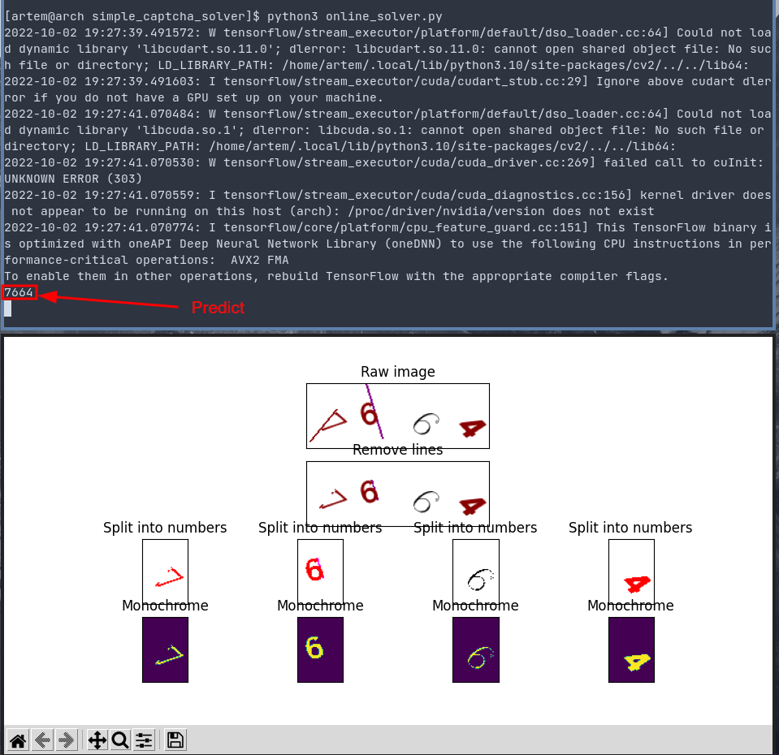

# simple_captcha_solver

Простая нейронная сеть, способная решать капчу с сайта https://foiz.ru/reg/captcha.php?1616923356 с точностью ~ **90% -
95%**.

Проект был написан в 2020 году во время работы в отделе компьютерного зрения для оттачивания навыков в сфере машинного
обучения.

## Dataset

Датасет для обучения, находящийся в `dataset/`, был размечен вручную из ~ 1500 капч. Есть проблемы с правильным
определением цифр `1` и `7` и, возможно, другие неточности.

## Основные запускаемые файлы

`train.py` - обучение нейронной сети на изображениях из `dataset/`

`check_model.py` - проверка нейронной сети на заранее подготовленных 100 изображениях из `test_images/`

`online_solver.py` - проверка нейронной сети в режиме онлайн с отрисовкой всех этапов обработки изображения

## Результаты

Нейросеть, в среднем, обучается распознаванию цифры с точностью 97% - 99%, что даёт процент угадывания всей 
капчи в 88% - 95%. При проверке с помощью `check_model.py`, лучшие модели позволяют угадывать 90-94 капч из 100!

_Пример решения капчи в real time режиме с помощью `online_solver.py`_

